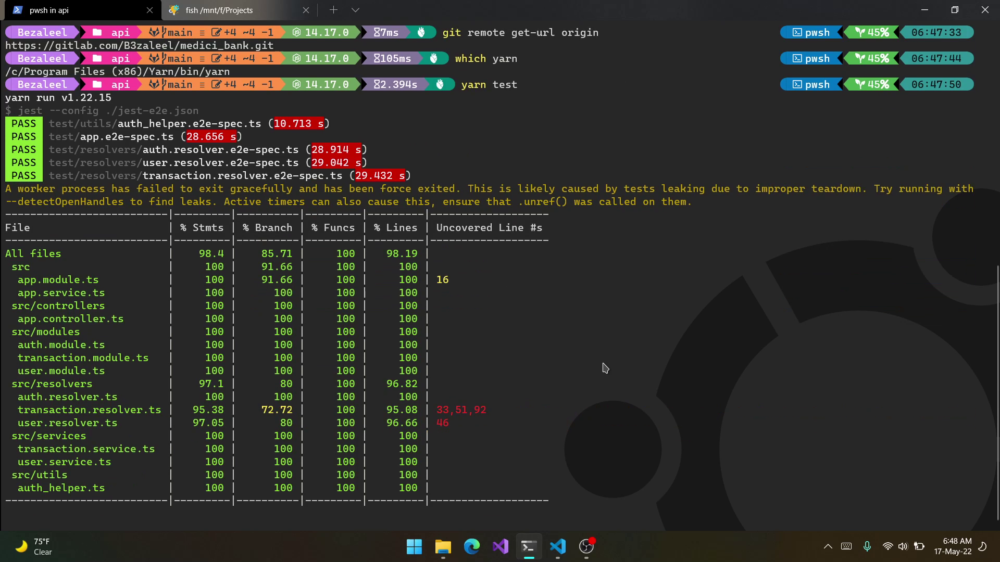

# Medici Bank API


[](https://opensource.org/licenses/MIT)

My Name: **Bezaleel Olakunori** [Email](mailto:bezaleeloci@gmail.com) [GitHub](https://github.com/B3zaleel) [Twitter](https://twitter.com/B3zaleel).

## Description

Medici bank is a simple fictitious banking API that is built with NestJs, and uses MongoDB as a persistent data storage system. The API uses a GraphQL querying system for system simplicity and to give you (the client) control over the data you want from the server. The API is hosted on Heroku [here](https://medici-bank-api.herokuapp.com) and you can communicate with it via the web app hosted on Netlify [here](https://medici-bank.netlify.app).

## Installation

To run the API, you would need to install the required Node modules using the command below:

```powershell
$ yarn install
```

## Environment Variables

Create a `.env` file with the following information in the format `Name=Value`:

| Name | Description |
|:--|:--|
| MONGO_DB_URI | The development/production URI for the MongoDB database. |
| MONGO_DB_URI_TEST | The testing URI for the MongoDB database. |
| JWT_SECRET | The secret key for signing JSON Web Tokens. |
| ARGON2_SALT | A 32 byte salt for password hashing with [argon2](https://argon2.online/). |

## Running The API

To run the API application, you would need access to a MongoDb database. After you have gotten a MongoDB server, store the database connection URI in the `MONGO_DB_URI` environment variable.

```powershell
# start the local mongodb database server (if it is installed)
$ sudo service mongodb start

# start the API application for development
$ yarn start

# start the API application for development in watch mode
$ yarn start:dev

# start the API application for production
$ yarn start:prod
```

## Running The Test Suites

To run the end to end (E2E) test suites, you would need access to a MongoDb database for testing. After you have gotten a MongoDB server, store the database connection URI in the `MONGO_DB_URI_TEST` environment variable.

```powershell
# start the local MongoDB database server (if you have installed MongoDB)
$ sudo service mongodb start

# Run the test script
$ yarn test
```

Click on the link below to watch the results of the testing process:

[](https://youtu.be/DOLGIQrma8g "A preview of the Medici bank's API testing results")

## Sample User Accounts

The following accounts can be used to test the API by signing in through the site [here](https://medici-bank.netlify.app).

```json
[
  {
    "name": "Jalen Fox",
    "phone": "03459506052",
    "password": "fru1tyl00p5"
  },
  {
    "name": "Boa Hancock",
    "phone": "08031578644",
    "password": "fr0573dfl4k35"
  }
]
```
